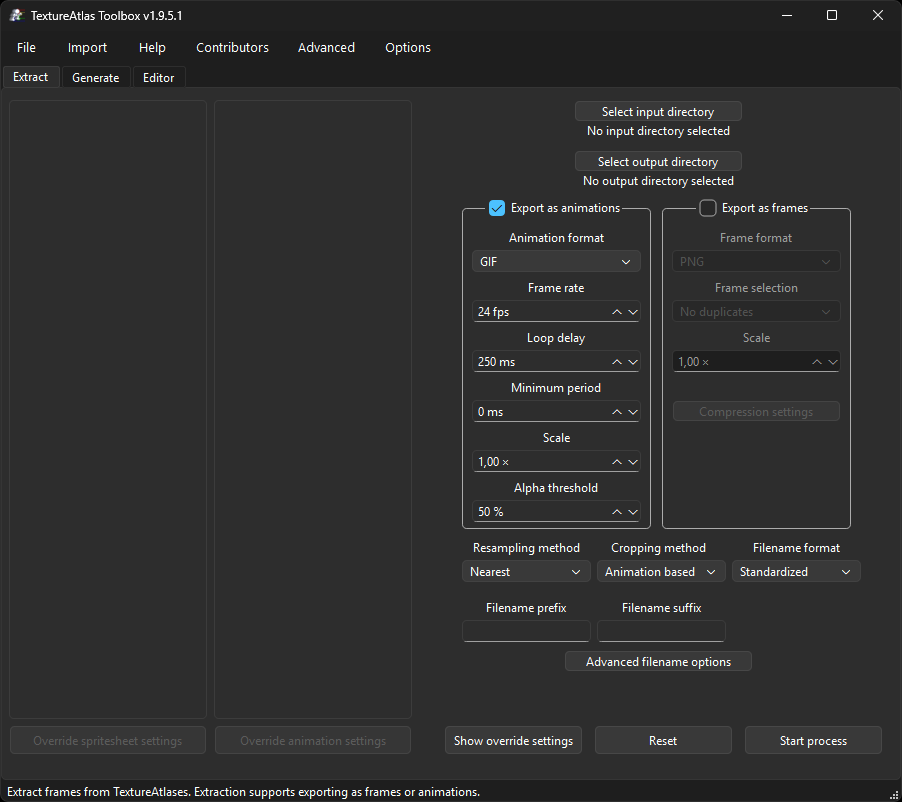
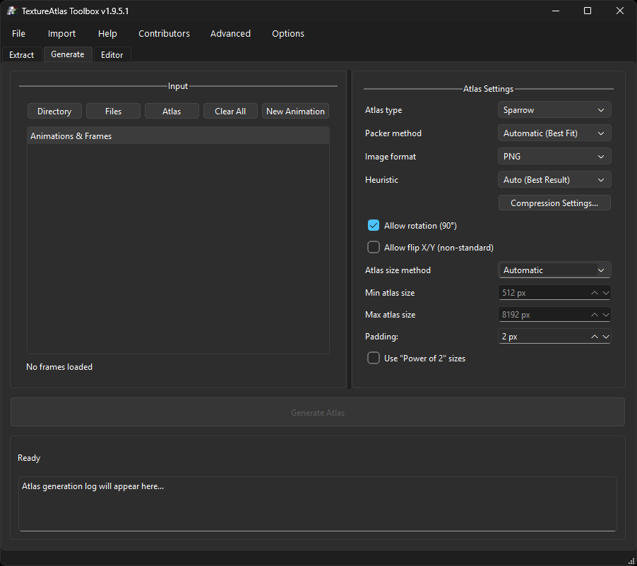
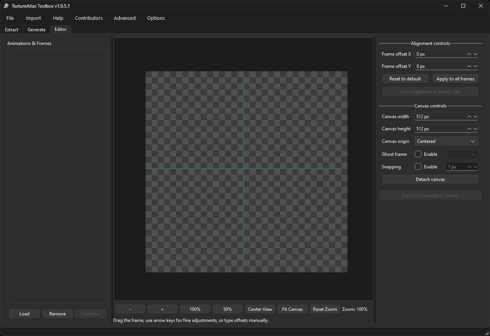
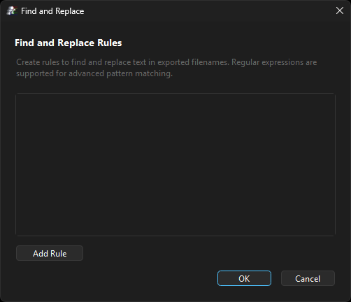

# User Manual

Complete guide for using TextureAtlas Toolbox to extract, generate, and edit texture atlases.

> **Note:** This documentation is community-maintained. Some sections may be incomplete or
> approximate. Feel free to open an issue if you spot something outdated.

## Table of Contents

-   [Getting Started](#getting-started)
-   [Interface Overview](#interface-overview)
    -   [Extract Tab](#extract-tab)
    -   [Generate Tab](#generate-tab)
    -   [Editor Tab](#editor-tab)
-   [Loading Texture Atlases](#loading-texture-atlases)
-   [Basic Animation Export](#basic-animation-export)
-   [Generating New Atlases](#generating-new-atlases)
-   [Advanced Settings](#advanced-settings)
-   [Output Formats](#output-formats)
-   [Tips and Best Practices](#tips-and-best-practices)

## Getting Started

1. Launch TextureAtlas Toolbox.
2. Choose your workflow:
    - **Extract tab**: Convert existing atlases into animations (GIF/WebP/APNG) and individual
      frames.
    - **Generate tab**: Build new atlases from loose frame images.
    - **Editor tab**: Manually align sprites and apply offset fixes.
3. Configure your settings and enjoy!

## Interface Overview

TextureAtlas Toolbox uses a tabbed interface powered by PySide6 (Qt 6).

### Extract Tab

The Extract tab handles batch processing of existing texture atlases into animations and frames.



#### Main Components

-   **Atlas List** (left panel): Shows all queued texture atlas files.
    and context menus for file management.
-   **Animation List** (second panel): Displays animations detected in the selected texture atlas.
-   **Input/Output Directories**: Select source folder containing texture atlases and destination for exports.
-   **Animation Export Group**: Configure animated output settings (GIF, WebP, APNG).
-   **Frame Export Group**: Configure individual frame output settings.

#### Animation Export Settings

| Setting         | Description                               | Range           |
| --------------- | ----------------------------------------- | --------------- |
| Format          | Output animation format                   | GIF, WebP, APNG |
| Frame rate      | Playback speed in frames per second       | 1–1000 FPS      |
| Loop delay      | Pause before animation restarts (ms)      | 0–10000 ms      |
| Min period      | Forces animation to be at least this long | 0–10000 ms      |
| Scale           | Output scaling multiplier                 | 0.01–100.0×     |
| Alpha threshold | Transparency cutoff for GIF format        | 0–100           |

#### Frame Export Settings

| Setting              | Description                     | Options                                       |
| -------------------- | ------------------------------- | --------------------------------------------- |
| Format               | Individual frame image format   | AVIF, BMP, DDS, PNG, TGA, TIFF, WebP          |
| Frame Selection      | Which frames to export          | All, No duplicates, First, Last, First & Last |
| Frame scale          | Scale multiplier for frames     | 0.01–100.0×                                   |
| Compression Settings | Format-specific quality options | Opens settings dialog                         |

#### Additional Settings

| Setting           | Description                         | Options                                           |
| ----------------- | ----------------------------------- | ------------------------------------------------- |
| Cropping method   | How to trim transparent borders     | None, Animation based, Frame based                |
| Resampling method | Interpolation algorithm for scaling | Nearest, Bilinear, Bicubic, Lanczos, Box, Hamming |
| Filename format   | Output filename sanitization        | Standardized, No spaces, No special characters    |
| Prefix            | Text prepended to output names      | Any text                                          |
| Suffix            | Text appended to output names       | Any text                                          |

#### Control Buttons

-   **Start Process**: Begin extraction with current settings.
-   **Reset**: Clear all loaded files from the queue.
-   **Advanced Filename**: Open find/replace rules for output naming.
-   **Override Settings**: Per-texture atlas or per-animation overrides.

### Generate Tab

The Generate tab creates new texture atlases from individual frame images or from existing texture atlases.



#### Main Components

-   **Animation Tree**: Hierarchical view of animation groups and their frames. Supports
    drag-and-drop reordering.
-   **Frame Input Buttons**: Add individual files, directories, or import from existing atlases.
-   **Packing Options**: Algorithm selection, padding, power-of-two sizing.
-   **Output Settings**: Metadata format and image compression.

#### Input Buttons

| Button             | Action                                                                 |
| ------------------ | ---------------------------------------------------------------------- |
| Add Files          | Select individual image files (PNG, BMP, DDS, JPEG, TGA, TIFF, WebP)   |
| Add Directory      | Import all images from a folder. Subfolders become separate animations |
| Add Animation      | Create an empty animation group for manual frame assignment            |
| Add Existing Atlas | Import frames from an existing atlas (image + XML/JSON/TXT data)       |
| Clear Frames       | Remove all loaded frames                                               |

#### Packing Algorithms

| Algorithm            | Description                                                        |
| -------------------- | ------------------------------------------------------------------ |
| Automatic (Best Fit) | Tries all algorithms and picks the most efficient result           |
| MaxRects             | Tracks free rectangles; handles varied sprite sizes well           |
| Guillotine           | Recursively splits space; efficient for uniformly-sized sprites    |
| Skyline              | Tracks top edge of placed sprites; fast for similar-height sprites |
| Shelf                | Row-based packing; fastest but may waste vertical space            |

Each algorithm offers **Heuristic** options for fine-tuning. There is no universally "best" packer
or heuristic—results depend on your sprite sizes and shapes.

It's recommended to use **Automatic (Best Fit)** for the algorithm and **Auto (Best Result)** for
the heuristic; the app will test all combinations and pick the most efficient result for your
specific atlas. If you prefer manual selection, **MaxRects** often yields the tightest packing for
varied sprite sets.

#### Heuristic Options

| Heuristic             | Description                                | Packer               |
| --------------------- | ------------------------------------------ | -------------------- |
| Auto (Best Result)    | Tries all heuristics; picks most efficient | All                  |
| Best Short Side Fit   | Minimizes wasted space on the short side   | MaxRects, Guillotine |
| Best Long Side Fit    | Minimizes wasted space on the long side    | MaxRects, Guillotine |
| Best Area Fit         | Minimizes total wasted area                | MaxRects, Guillotine |
| Bottom-Left           | Places sprites as low and left as possible | MaxRects, Skyline    |
| Contact Point         | Maximizes contact with edges/other sprites | MaxRects             |
| Worst Area Fit        | For more uniform distribution              | Guillotine           |
| Shorter Leftover Axis | Split along the shorter leftover side      | Guillotine (split)   |
| Longer Leftover Axis  | Split along the longer leftover side       | Guillotine (split)   |
| Shorter Axis          | Split along the shorter frame side         | Guillotine (split)   |
| Longer Axis           | Split along the longer frame side          | Guillotine (split)   |
| Min Area              | Minimize area of smallest resulting rect   | Guillotine (split)   |
| Max Area              | Maximize area of smallest resulting rect   | Guillotine (split)   |
| Min Waste             | Place where least space is wasted below    | Skyline              |
| Best Fit              | Find position matching skyline contour     | Skyline              |
| Next Fit              | Always use the current (last) shelf        | Shelf                |
| First Fit             | Use first shelf where sprite fits          | Shelf                |
| Best Width Fit        | Use shelf with least remaining width       | Shelf                |
| Best Height Fit       | Use shelf matching sprite height best      | Shelf                |
| Worst Width Fit       | Use shelf with most remaining width        | Shelf                |

> **Note:** Guillotine uses two heuristics together: a **placement** heuristic (Best Short/Long
> Side Fit, Best/Worst Area Fit) and a **split** heuristic (marked with "split" above).

#### Atlas Options

| Option         | Description                                                             |
| -------------- | ----------------------------------------------------------------------- |
| Atlas Size     | Automatic, Manual, or Max Size (limit only)                             |
| Padding        | Pixels between sprites (helps prevent texture bleeding)                 |
| Power of Two   | Force dimensions like 512×512, 1024×1024                                |
| Allow Rotation | Enable 90° rotation for tighter packing (format-dependent)              |
| Allow Flip     | Enable sprite flipping (only supported by Starling XML with HaxeFlixel) |

### Editor Tab

The Editor tab provides an interactive alignment workspace for manual sprite adjustments.



#### Main Components

-   **Animation Tree**: Lists loaded animations and their individual frames.
-   **Alignment Canvas**: Interactive preview with zoom, pan, and drag support.
-   **Offset Controls**: Manual X/Y offset entry with apply-all functionality.
-   **Canvas Size**: Adjustable virtual canvas dimensions (multiples of 256).
-   **Ghost Overlay**: Semi-transparent reference frame for alignment comparison.

#### Canvas Controls

| Control                         | Action                        |
| ------------------------------- | ----------------------------- |
| Left-click + drag on sprite     | Move the sprite offset        |
| Left-click + drag on background | Pan the viewport              |
| Ctrl + scroll wheel             | Zoom in/out                   |
| Arrow keys                      | Fine adjustment (1px steps)   |
| Shift + Arrow keys              | Faster adjustment (5px steps) |

#### Features

-   **Ghost Overlays**: Show a semi-transparent reference frame for alignment.
-   **Snap to Grid**: Enable snapping with configurable step size.
-   **Origin Mode**: Choose between Center or Top-Left origin for offset calculations.
-   **Detachable Canvas**: Pop out the canvas to a separate window for more space.
-   **Batch Offset Application**: Apply the current offset to all frames in an animation.
-   **Save Overrides**: Store alignment data for use in the Extract tab.
-   **Export Composite**: Create combined animations from multiple sources.

## Loading Texture Atlases

### Supported Input Formats

#### Image Files

The application supports all common image formats:

-   **PNG** (recommended for sprites with transparency)
-   **BMP**, **DDS**, **JPEG/JPG**, **TGA**, **TIFF**, **WebP**

#### Metadata Formats

TextureAtlas Toolbox automatically detects and parses many texture atlas formats.
For detailed technical specifications, see the [Format Reference](format-reference.md).

| Format                  | Extension         | Description                                |
| ----------------------- | ----------------- | ------------------------------------------ |
| Starling/Sparrow XML    | `.xml`            | Most common format used by texture packers |
| TexturePacker TXT       | `.txt`            | Simple text-based format                   |
| JSON Hash               | `.json`           | Sprites keyed by name                      |
| JSON Array              | `.json`           | Sprites in array order                     |
| Aseprite JSON           | `.json`           | Exported from Aseprite                     |
| Spine Atlas             | `.atlas`          | Spine animation format                     |
| Phaser 3 JSON           | `.json`           | Phaser game framework format               |
| CSS Spritesheet         | `.css`            | CSS background-position definitions        |
| Plist (Cocos2d)         | `.plist`          | Apple property list format                 |
| UIKit Plist             | `.plist`          | iOS UIKit variant                          |
| Godot Atlas             | `.tpsheet`, `.tpset` | Godot game engine format                   |
| Egret2D JSON            | `.json`           | Egret game engine format                   |
| Paper2D                 | `.paper2dsprites` | Unreal Engine Paper2D                      |
| Unity TexturePacker     | `.tpsheet`        | Unity-compatible format                    |
| Adobe Animate Spritemap | `.json` pair      | `Animation.json` + `spritemap.json` pairs  |

#### Metadata-Free Images

For texture atlass without metadata files, the application can extract sprites using:

-   **Color keying**: Remove solid background colors automatically
-   **Grid-based slicing**: Divide image into equal-sized cells

> ⚠️ **Adobe Animate Spritemaps**: These are significantly more memory-intensive than other
> formats. Expect higher RAM and CPU usage. See [Performance Notes](installation-guide.md#performance-notes)
> for recommendations.

### Loading Process

1. Click **Select input directory** or drag files directly onto the texture atlas list.
2. The application scans for matching metadata files automatically.
3. Select a texture atlas from the left list to view its animations.
4. Choose animations to export or select all.

### Metadata File Examples

#### XML Format (Starling/Sparrow)

```xml
<TextureAtlas imagePath="texture atlas.png">
    <SubTexture name="character_idle_0001" x="0" y="0" width="64" height="64"/>
    <SubTexture name="character_idle_0002" x="64" y="0" width="64" height="64"/>
    <SubTexture name="character_walk_0001" x="0" y="64" width="64" height="64"/>
</TextureAtlas>
```

#### TXT Format (TexturePacker)

```
character_idle_0001.png
xy: 0, 0
size: 64, 64
orig: 64, 64
offset: 0, 0

character_idle_0002.png
xy: 64, 0
size: 64, 64
orig: 64, 64
offset: 0, 0
```

#### JSON Hash Format

```json
{
	"frames": {
		"character_idle_0001": {
			"frame": { "x": 0, "y": 0, "w": 64, "h": 64 },
			"rotated": false,
			"trimmed": false,
			"sourceSize": { "w": 64, "h": 64 }
		}
	},
	"meta": {
		"image": "texture atlas.png",
		"size": { "w": 256, "h": 256 }
	}
}
```

## Basic Animation Export

### Quick Export Workflow

1. Load your texture atlas(s) using **Select input directory** or drag-and-drop.
2. Choose an **output directory** for the exported files.
3. Select the texture atlas from the left panel.
4. Review detected animations in the second panel.
5. Configure export settings:
    - Enable/disable **Animation export** and **Frame export** groups as needed.
    - Set your desired format, frame rate, and scale.
6. Click **Start Process** to begin.

### Output Structure

```
output_directory/
├── texture atlas_name/
│   ├── animation_name.gif
│   ├── animation_name_frames/
│   │   ├── frame_001.png
│   │   ├── frame_002.png
│   │   └── ...
│   └── ...
```

## Advanced Settings

The following settings are available in the Extract tab's bottom panel and settings windows.

### Cropping Options

| Mode            | Description                                            |
| --------------- | ------------------------------------------------------ |
| None            | Keep original frame dimensions (no cropping)           |
| Animation based | Uniform cropping across all frames in an animation     |
| Frame based     | Individual cropping per frame (smallest possible size) |

### Resampling Methods

When scaling images, choose the interpolation algorithm:

| Method   | Best For                  | Speed   |
| -------- | ------------------------- | ------- |
| Nearest  | Pixel art, retro graphics | Fastest |
| Bilinear | Fast smooth scaling       | Fast    |
| Bicubic  | General purpose           | Medium  |
| Lanczos  | High-quality photos       | Slower  |
| Box      | Downscaling               | Fast    |
| Hamming  | Smooth with less blur     | Medium  |

> **Tip:** Use **Nearest** for pixel art to preserve sharp edges. **Bicubic** usually do a good job

### Filename Formatting

| Format                | Description                            |
| --------------------- | -------------------------------------- |
| Standardized          | Default naming with spaces preserved   |
| No spaces             | Replace spaces with underscores        |
| No special characters | Remove all non-alphanumeric characters |

#### Prefix and Suffix

Add custom text before or after animation/frame names:

-   **Prefix**: Text added at the beginning (e.g., `player_`)
-   **Suffix**: Text added at the end (e.g., `_v2`)

#### Find/Replace Rules

Create advanced renaming rules:

1. Click **Advanced filename** button.
2. Add rules with **Find** pattern (supports regex) and **Replace** text.
3. Choose whether to apply to filenames, animation names, or both.




### Override Settings

Apply custom settings to specific texture atlass or animations:

-   **Override texture atlas Settings**: Right-click a texture atlas or use the button.
-   **Override Animation Settings**: Right-click an animation for per-animation overrides.

Overrides persist across sessions and take precedence over global settings.

## Output Formats

### Animation Formats

#### GIF Format

-   **Best for**: Web compatibility, small file sizes, universal support
-   **Features**: Transparency (1-bit), animation, works everywhere
-   **Limitations**: 256 colors maximum, no partial transparency
-   **Settings**: Alpha threshold controls transparency cutoff

#### WebP Format

-   **Best for**: Modern web applications, superior compression
-   **Features**: True 8-bit transparency, lossy or lossless compression
-   **Limitations**: Older browser/software support
-   **Quality**: Typically 25–35% smaller than equivalent GIF

#### APNG Format

-   **Best for**: High-quality animations with full transparency
-   **Features**: 24-bit color, full alpha channel, PNG compatibility
-   **Limitations**: Limited software support, larger file sizes
-   **Use case**: When quality is paramount and GIF's 256 colors are insufficient

### Frame Export Formats

| Format | Extension | Features                                         |
| ------ | --------- | ------------------------------------------------ |
| PNG    | `.png`    | Lossless, full transparency, recommended default |
| AVIF   | `.avif`   | Modern format, excellent compression             |
| WebP   | `.webp`   | Good compression, wide support                   |
| BMP    | `.bmp`    | Uncompressed, legacy support                     |
| DDS    | `.dds`    | DirectX texture format, game engines             |
| TGA    | `.tga`    | Truevision format, game development              |
| TIFF   | `.tiff`   | Professional imaging, lossless                   |

### Frame Selection Options

| Option        | Exports                           |
| ------------- | --------------------------------- |
| All           | Every frame in the animation      |
| No duplicates | Skip identical consecutive frames |
| First         | Only the first frame              |
| Last          | Only the last frame               |
| First, Last   | First and last frames only        |

### Troubleshooting Export Issues

#### "XML/TXT frame dimension data doesn't match"

-   Atlas dimensions in metadata don't match actual image
-   Try reducing alpha threshold
-   Check for corrupted atlas file

#### Frames appear shifted or cropped incorrectly

-   Use the Editor tab to verify alignment
-   Check if original frames were trimmed
-   Disable cropping temporarily to diagnose

## Generating New Atlases

The Generate tab creates texture atlases from loose frame images.

### Basic Workflow

1. Switch to the **Generate** tab.
2. Add your frame images using one of the input methods:
    - **Add Files**: Select individual images.
    - **Add Directory**: Import entire folder (subfolders become separate animations).
    - **Add Existing Atlas**: Import and re-pack an existing atlas.
3. Organize frames in the animation tree (drag to reorder).
4. Select a packing algorithm (or use Automatic).
5. Configure atlas options:
    - **Padding**: Space between frames (2px recommended to prevent bleeding).
    - **Power of Two**: Enable for older GPU compatibility.
    - **Allow Rotation**: Enable for tighter packing (format-dependent).
6. Choose your output metadata format.
7. Click **Generate** and specify the output location.

### Packing Algorithms Explained

#### Automatic (Best Fit)

Runs all available algorithms and selects the result with highest packing efficiency.
Slower but guarantees optimal results.

#### MaxRects

The most versatile algorithm. Maintains a list of free rectangles and places each sprite
in the best available position. Supports multiple heuristics:

-   **Best Short Side Fit**: Minimizes wasted short side
-   **Best Long Side Fit**: Minimizes wasted long side
-   **Best Area Fit**: Minimizes wasted area
-   **Bottom Left**: Places sprites as low and left as possible
-   **Contact Point**: Maximizes contact with already-placed sprites

#### Guillotine

Subdivides the atlas recursively. Each placement splits the remaining space into two
rectangles. Fast with good results for uniformly-sized sprites.

#### Skyline

Tracks the "skyline" (top edge) of placed sprites. Very fast algorithm that works
well for sprites of similar heights.

#### Shelf

Simple row-based packing. Places sprites in horizontal rows. Fastest algorithm but
may waste vertical space when sprite heights vary significantly.

### Supported Output Formats

For complete format specifications including field details and examples, see the
[Format Reference](format-reference.md).

| Format               | Extension         | Use Case                      |
| -------------------- | ----------------- | ----------------------------- |
| Sparrow/Starling XML | `.xml`            | Flash/AIR, HaxeFlixel, OpenFL |
| JSON Hash            | `.json`           | General purpose, easy parsing |
| JSON Array           | `.json`           | Ordered frame data            |
| Aseprite JSON        | `.json`           | Aseprite compability          |
| TexturePacker XML    | `.xml`            | TexturePacker compatibility   |
| Spine Atlas          | `.atlas`          | Spine 2D animations           |
| Phaser 3 JSON        | `.json`           | Phaser game framework         |
| CSS Spritesheet      | `.css`            | Web development               |
| Plain Text           | `.txt`            | Simple text format            |
| Plist (Cocos2d)      | `.plist`          | Cocos2d game engine           |
| UIKit Plist          | `.plist`          | iOS native development        |
| Godot Atlas          | `.tpsheet`, `.tpset` | Godot game engine             |
| Egret2D JSON         | `.json`           | Egret game engine             |
| Paper2D              | `.paper2dsprites` | Unreal Engine 4/5             |
| Unity TexturePacker  | `.tpsheet`        | Unity game engine             |

### Rotation and Flip Support

Not all formats support rotated or flipped sprites:

| Feature      | Supported Formats                                                                           |
| ------------ | ------------------------------------------------------------------------------------------- |
| 90° Rotation | Starling XML, JSON Hash/Array, Aseprite, TexturePacker XML, Spine, Phaser 3, Plist, Paper2D |
| Flip         | Starling XML only (HaxeFlixel extension)                                                    |

> **Note:** Flip support is non-standard. Only HaxeFlixel's Sparrow implementation reads flip
> attributes. Most engines ignore them.

## Tips and Best Practices

### File Organization

-   **Keep atlas and metadata together**: Store the image and its metadata file (XML/JSON/TXT)
    in the same directory for automatic detection.
-   **Use consistent naming**: The app matches files by base name (e.g., `player.png` + `player.xml`).
-   **Organize by project**: Create separate input folders for different projects or game states.

### Performance Optimization

-   **Close other applications** when processing Adobe Animate spritemaps (memory-intensive).
-   **Use fewer worker threads** if you encounter memory issues on systems with limited RAM.
-   **SSD storage** significantly speeds up batch processing.
-   **Reduce atlas count** by combining related animations into single texture atlass.

### Quality Tips

-   **Choose the right format**:

    -   GIF for maximum compatibility
    -   WebP for modern projects with size constraints
    -   APNG for high-quality with transparency
    -   PNG frames for source-quality archives

-   **Scaling considerations**:

    -   Use **Nearest** resampling for pixel art (preserves sharp edges)
    -   Use **Lanczos** for photographic or anti-aliased content
    -   Scale in the atlas generator rather than at runtime for better quality

-   **Padding recommendations**:
    -   Use 2px padding minimum to prevent texture bleeding
    -   Increase to 4px if you'll be applying filters or effects
    -   Power-of-two dimensions improve GPU performance on older hardware

### Workflow Tips

-   **Use the Editor tab** to verify alignment before batch exports.
-   **Create override settings** for texture atlass that need special treatment.
-   **Test with a small batch** before processing hundreds of files.
-   **Save your configuration** — settings persist between sessions.

### Common Issues

| Problem            | Solution                                                         |
| ------------------ | ---------------------------------------------------------------- |
| Missing animations | Check that metadata file exists and matches image name           |
| Blurry output      | Use Nearest resampling for pixel art                             |
| Texture bleeding   | Increase padding in generator settings                           |
| Out of memory      | Process fewer files at once, close other apps                    |
| Wrong frame order  | Rename source files with numeric suffixes (e.g., `walk_001.png`) |

---

_For additional help, see the [FAQ](faq.md) or [Friday Night Funkin' Guide](fnf-guide.md) for
specialized workflows._

---

_Last updated: December 6, 2025 — TextureAtlas Toolbox v2.0.0_
